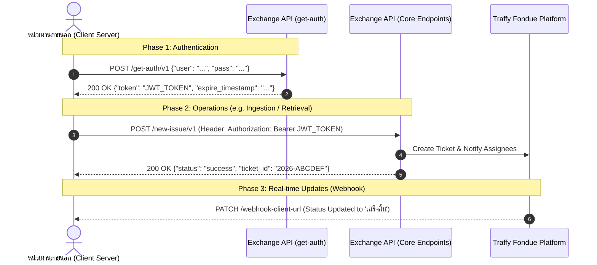

# Technical Context & Integration Architecture

เอกสารระบุบริบททางเทคนิค (Technical Context), สถาปัตยกรรมระบบ, โครงสร้างข้อมูล, และรูปแบบการเชื่อมต่อของ **Traffy Fondue Exchange API**

---

## 1. ข้อมูลระบบและสิ่งแวดล้อม (System Overview)

- **Platform:** Traffy Fondue Open Exchange Platform (NSTDA / NECTEC)
- **Base URL:** `https://publicapi.traffy.in.th/exchange-api`
- **Authentication Scheme:** JWT Bearer Authentication (`Authorization: Bearer <token>`)
- **Protocol & Data Format:** HTTPS / JSON over HTTP POST
- **Encoding:** UTF-8
- **Timezone:** Asia/Bangkok (UTC+7)
- **Target Audience:** หน่วยงานภาครัฐ, องค์กรปกครองส่วนท้องถิ่น (อปท.), รัฐวิสาหกิจ, ภาคเอกชน, และผู้พัฒนาระบบภายนอก

---

## 2. โครงสร้างข้อมูลหลัก (Core Schemas)

### 2.1 Issue Data Model
* **`ticket_id` (string):** รหัสเรื่องแจ้งในระบบ Fondue (เช่น `2026-ABCDEF`)
* **`client_ticket_id` (string, optional):** รหัสอ้างอิงของหน่วยงานภายนอก
* **`description` (string):** รายละเอียดข้อความการแจ้งปัญหา
* **`type_id` / `type` (integer / string):** รหัสและชื่อหมวดหมู่ปัญหา (เช่น `12`, `"ถนน"`)
* **`latitude` / `longitude` (number):** พิกัด GPS (WGS84)
* **`address` (string):** ที่อยู่หรือสถานที่เกิดเหตุ
* **`state` / `status` (string):** สถานะการดำเนินงาน (`รอรับเรื่อง`, `กำลังดำเนินการ`, `เสร็จสิ้น`, `ส่งต่อ`)
* **`photo` (array[string]):** รายการ URL รูปภาพที่จัดเก็บบน Cloud Storage
* **`orgs` (array[object]):** รายการหน่วยงานที่เกี่ยวข้องและรับผิดชอบ

### 2.2 Quota & Usage Model
* **`credit_balance` (integer):** โควต้าคงเหลือในรอบเดือนปัจจุบัน (-1 คือไม่จำกัด)
* **`quota_limit` (integer):** จำนวนโควต้าสูงสุดที่ได้รับจัดสรรต่อเดือน
* **`permissions` (array[string]):** สิทธิ์การเข้าถึง เช่น `["read", "write"]`

---

## 3. ความปลอดภัยและข้อควรระวัง (Security Principles)

1. **Server-to-Server Only:** การเรียก API และการเก็บ Credential (`user`/`pass`) ต้องทำในระบบฝั่ง Server เท่านั้น ห้ามนำไปฝังใน Client-side Web หรือ Mobile App
2. **Bearer Token Headers:** ทุก Endpoint (ยกเว้น `get-auth`) ต้องส่ง Header `Authorization: Bearer <token>`
3. **Webhook Verification:** Endpoint รับ Webhook ของหน่วยงานควรเปิดรับเฉพาะ HTTPS และมีระบบตรวจสอบ Payload เพื่อความปลอดภัย
