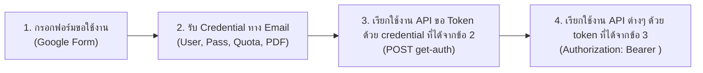

# Traffy Fondue Exchange API - Documentation Overview

คู่มือการใช้งาน **Traffy Fondue Exchange API** สำหรับหน่วยงานภายนอกและผู้พัฒนาระบบ เพื่อเชื่อมโยงข้อมูลเรื่องแจ้งเหตุ ปัญหาเมือง และการติดตามสถานะการแก้ไขปัญหากับแพลตฟอร์ม Traffy Fondue

---

## 🔹 รูปแบบการเชื่อมต่อ (Integration Modes)

ระบบ Traffy Fondue Exchange API แบ่งรูปแบบการทำงานออกเป็น 3 รูปแบบหลัก:

### 📤 1. ส่งข้อมูลเข้า Traffy Fondue (Data Ingestion)
ใช้สำหรับเชื่อมต่อระบบรับเรื่องแจ้งของหน่วยงานเข้าสู่ระบบ Traffy Fondue
* [`new-issue`](action-apis.md#api-new-issue-v1): ส่งเรื่องแจ้งใหม่เข้าสู่ระบบ Fondue
* [`update-issue`](action-apis.md#api-update-issue-v1): อัปเดต/ปรับสถานะเรื่องแจ้ง (รับเรื่อง, กำลังทำ, เสร็จสิ้น ฯลฯ)
* [`star`](action-apis.md#api-star-v1): บันทึกคะแนนความพึงพอใจของผู้แจ้ง (1-5 ดาว)
* [`comment`](action-apis.md#api-comment-v1): ส่งความเห็นเพิ่มเติมหรือข้อความสนทนากับผู้แจ้ง (ถ้าผู้แจ้งมีช่องทางให้ติดต่อกลับได้)
* [`join-forward`](action-apis.md#api-join-forward-v1): เชิญหน่วยงานอื่นร่วมรับผิดชอบ หรือส่งต่อเรื่องแจ้ง

### 📥 2. ขอข้อมูลจาก Traffy Fondue (Data Retrieval)
ใช้สำหรับดึงข้อมูลเรื่องแจ้งและข้อมูลระบบไปแสดงผลหรือประมวลผลต่อในระบบของหน่วยงาน
* [`get-issues`](query-apis.md#1-api-get-issues-ขอรายการเรื่องแจ้ง): ดูรายการเรื่องแจ้งของหน่วยงาน พร้อมระบบตัวกรอง (v2)
* [`download-issues`](query-apis.md#3-api-download-issues-ดาวน์โหลดไฟล์-csv): ดาวน์โหลดข้อมูลเรื่องแจ้งเป็นไฟล์ CSV (v2)
* [`get-issue`](query-apis.md#2-api-get-issue-ขอรายละเอียดเชิงลึกของเรื่องแจ้ง): ดูรายละเอียดเชิงลึกและประวัติการดำเนินงานของเรื่องแจ้งตาม `ticket_id`
* [`search-org`](query-apis.md#4-api-search-org-ค้นหาหน่วยงาน): ค้นหาหน่วยงานอื่นจากชื่อ
* [`get-org-list`](query-apis.md#5-api-get-org-list-ขอโครงสร้างหน่วยงานในสังกัด): ดูผังโครงสร้างรายชื่อหน่วยงานในสังกัด
* [`get-type-list`](query-apis.md#6-api-get-type-list-ขอรายการประเภทปัญหา): ดูรายการประเภทปัญหาที่หน่วยงานรับผิดชอบ (v2)
* [`get-status-list`](query-apis.md#7-api-get-status-list-ขอรายการสถานะ): ดูรายการสถานะของเรื่องแจ้งที่สามารถใช้งานได้ (v2)

### 🔔 3. ส่งข้อมูลแบบ Real-time (Webhooks / Push)
ระบบจะส่งข้อมูลไปยัง API Endpoint ปลายทางของหน่วยงานอัตโนมัติแบบ Real-time โดยไม่หักโควต้า (Non credit-balance)
* **เมื่อมีเรื่องแจ้งใหม่:** ส่ง `POST` พร้อมข้อมูลเรื่องแจ้งและพิกัดไปยัง Webhook URL ของหน่วยงาน
* **เมื่อมีการอัปเดตสถานะ:** ส่ง `PATCH` พร้อมข้อมูลสถานะล่าสุดและภาพถ่ายการดำเนินงานไปยัง Webhook URL ของหน่วยงาน

---

## 🚀 ขั้นตอนการขอใช้งาน Exchange API (Onboarding)

1. **1️⃣ กรอกแบบฟอร์มสมัครใช้งาน:**
   * กรอกข้อมูลหน่วยงานและผู้ประสานงานที่ [Google Form ขอใช้งาน Exchange API](https://forms.gle/bvFEhjPHSmU1x7wP7)
2. **2️⃣ รับข้อมูลทางอีเมล:**
   * ทีมงานจะจัดส่งข้อมูลการเข้าถึงทางอีเมล ได้แก่:
     * เอกสาร Traffy Fondue Exchange API Document
     * `Username`
     * `Password`
     * โควต้าการใช้งานต่อเดือน (`quota_limit`)
3. **3️⃣ ขอ Token เพื่อใช้งาน API:**
   * นำ `Username` และ `Password` ไปเรียก API [`get-auth`](authentication.md) เพื่อรับ JWT Token
4. **4️⃣ เริ่มใช้งาน API:**
   * นำ Token ที่ได้รับไปใส่ใน HTTP Header: `Authorization: Bearer <token>` สำหรับเรียก API อื่นๆ

---

## ⚠️ ข้อกำหนดเรื่องโควต้า (Credit Balance)

* การเรียก API (เกือบทุกตัว) จะมีการนับจำนวนครั้งการใช้งาน (`credit_balance`) ตามที่ได้รับจัดสรรต่อเดือน
* โควต้าจะถูกรีเซ็ตใหม่ทุกวันที่ 1 ของเดือน
* หากโควต้าใกล้หมดหรือต้องการเพิ่มโควต้าเป็นกรณีพิเศษ สามารถติดต่อทีมงานได้ทาง LINE: **[@fonduehelp](https://line.me/R/ti/p/%40155yjrwo)**
